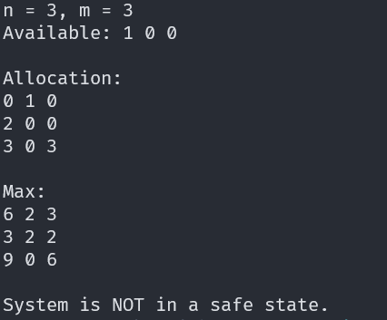
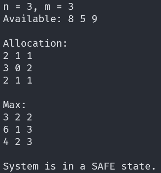

# Operating Systems Assignment 2

## Table of Contents

- [Operating Systems Assignment 2](#operating-systems-assignment-2)
  - [Table of Contents](#table-of-contents)
  - [0. Prerequisites](#0-prerequisites)
    - [0.1 Operating System](#01-operating-system)
    - [0.2 Compiler](#02-compiler)
    - [0.3 Build Tools](#03-build-tools)
  - [1. Clone the Repository](#1-clone-the-repository)
  - [2. Compile the Project](#2-compile-the-project)
  - [3. Run the Program](#3-run-the-program)
    - [3.1 Serialization](#31-serialization)
    - [3.2 Running the Banker](#32-running-the-banker)
  - [4. Clean Up](#4-clean-up)
  - [5. File Format Specifications](#5-file-format-specifications)
    - [5.1 Text Input File Format](#51-text-input-file-format)
    - [5.2 Binary Serialization Format](#52-binary-serialization-format)
  - [6. Algorithm Overview](#6-algorithm-overview)
    - [6.1 The Banker's Algorithm](#61-the-bankers-algorithm)
    - [6.2 Assignment Solution](#62-assignment-solution)
  - [7. Detailed Code Walkthrough](#7-detailed-code-walkthrough)
    - [7.1 serialize.cpp](#71-serializecpp)
    - [7.2 banker.cpp](#72-bankercpp)
  - [8. Example Outputs](#8-example-outputs)
    - [8.1 Example Text Output](#81-example-text-output)
  - [8.2 Example Images](#82-example-images)

## Changelog

`1af4c47` `2025-11-19 09:53` Fix section numbering

`35b066c` `2025-11-19 09:41` Include binary/input file spec

`0a4d406` `2025-11-19 09:37` Add README.md

`c143d59` `2025-11-19 00:47` Add input 8 from problem in assignment document

`4ac0470` `2025-11-19 00:35` Add second example image

`3c88d75` `2025-11-19 00:35` Add first example image

`24757cd` `2025-11-19 00:31` Oh this serialize needs to be in the Makefile

`b4f0e6e` `2025-11-19 00:30` Success message!

`b8c6830` `2025-11-19 00:29` Serialize allocation and max matricies

`1b78174` `2025-11-19 00:29` Write configuration to binary

`d5dfa6e` `2025-11-19 00:28` Open binary output file for serialization

`af2e021` `2025-11-19 00:28` Read maximum demand matrix

`40a9f7d` `2025-11-19 00:27` Read allocation matrix

`0f5be9a` `2025-11-19 00:27` Read total system resources

`9d74b70` `2025-11-19 00:25` Read matrix dimensions

`35f4d29` `2025-11-19 00:25` Open and validate input file stream

`e585764` `2025-11-19 00:25` Add cmdline parsing for file in/out

`36aec66` `2025-11-19 00:24` Add serialize handler file

`af4fa73` `2025-11-19 00:24` Add text input files (we will need to handle converting these to machine readable)

`e9283dd` `2025-11-19 00:15` Whoops I need to close the input file

`0bd144f` `2025-11-19 00:14` Print safe state message and process execution order

`a543187` `2025-11-19 00:13` Final safety check if all processes have completed successfully

`99eb12d` `2025-11-19 00:13` Resource release and safe sequence tracking

`01c82c9` `2025-11-19 00:12` Process eligibility logic based on available and needed resources

`80b0f72` `2025-11-19 00:11` Outer iteration structure for safe sequence search

`1588efd` `2025-11-19 00:10` Calculate need matrix

`6c2345b` `2025-11-19 00:08` Debug printing

`4527af0` `2025-11-19 00:07` Read maximum from input file

`f993e4c` `2025-11-19 00:06` Read allocated array from input file

`00d59a2` `2025-11-19 00:06` Read available input from file

`35f6f6b` `2025-11-19 00:05` Read dimensions from input file

`b014158` `2025-11-19 00:04` Add basic input file reading

`625a237` `2025-11-19 00:03` Add Makefile

`f1ad76c` `2025-11-19 00:03` Add empty banker.cpp

`bd10529` `2025-11-19 00:02` Initialize repo


## 0. Prerequisites

### 0.1 Operating System

This program utilizes the standard C++ Standard Library (`<vector>`, `<fstream>`, `<iostream>`) and does not rely on OS-specific headers like `<unistd.h>` or `<windows.h>`. Therefore, it is cross-platform and compatible with:

- **Linux** (Ubuntu, Fedora, Debian, etc.)
- **Windows** (via MinGW, Cygwin, or WSL)
- **macOS**

### 0.2 Compiler

A C++ compiler supporting **C++17** or later is required.

- `g++` (GNU C++ Compiler)
- `clang++` (LLVM)

### 0.3 Build Tools

- **GNU Make**: Used to automate the compilation process.

## 1. Clone the Repository

Clone the repository to your local machine:

```sh
git clone https://github.com/monster0506/OperatingSystemsAssignment2
cd OperatingSystemsAssignment2
```

Verify the directory structure:

```sh
ls -R
```

You should see:

- `banker.cpp`
- `serialize.cpp`
- `Makefile`
- `inputs/` directory containing test files.

## 2. Compile the Project

The project includes a `Makefile` for easy compilation.

To compile both the `serialize` utility and the `banker` program:

```sh
make
```

This will produce two executables:

1. `serialize` (or `serialize.exe` on Windows)
2. `banker` (or `banker.exe` on Windows)

## 3. Run the Program

The execution flow involves two steps: converting the input to a binary format, and then processing it with the Banker's Algorithm.

### 3.1 Serialization

The `banker` program is designed to read **binary** files for efficiency. However, the input datasets are provided as human-readable **text** files (in the `inputs/` directory).

Use the `serialize` utility to convert a text input file into a binary output file.

**Usage:**

```sh
./serialize <input_text_file> <output_binary_file>
```

**Example:**

```sh
./serialize inputs/input8.txt input8.bin
```

### 3.2 Running the Banker

Once the binary file is generated, feed it into the `banker` program.

**Usage:**

```sh
./banker <binary_file>
```

**Example:**

```sh
./banker input8.bin
```

## 4. Clean Up

To remove the compiled executables and object files, run:

```sh
make clean
```

## 5. File Format Specifications

### 5.1 Text Input File Format

The text input files (located in the `inputs/` directory) follow a specific human-readable format:

```text
<n> <m>
<Available[0]> <Available[1]> ... <Available[m-1]>
Allocation
<Allocation[0][0]> <Allocation[0][1]> ... <Allocation[0][m-1]>
<Allocation[1][0]> <Allocation[1][1]> ... <Allocation[1][m-1]>
...
<Allocation[n-1][0]> <Allocation[n-1][1]> ... <Allocation[n-1][m-1]>
Max
<Max[0][0]> <Max[0][1]> ... <Max[0][m-1]>
<Max[1][0]> <Max[1][1]> ... <Max[1][m-1]>
...
<Max[n-1][0]> <Max[n-1][1]> ... <Max[n-1][m-1]>
```

**Field Descriptions:**

- **Line 1**: Two integers separated by whitespace
  - `n`: Number of processes in the system
  - `m`: Number of resource types
- **Line 2**: `m` integers separated by whitespace
  - `Available[j]`: The number of available instances of resource type `j`
- **Line 3**: The literal string `"Allocation"` (label/header)
- **Lines 4 to 3+n**: The Allocation matrix (`n` rows, `m` columns)
  - `Allocation[i][j]`: Number of instances of resource type `j` currently allocated to process `i`
- **Line 4+n**: The literal string `"Max"` (label/header)
- **Lines 5+n to 4+2n**: The Max matrix (`n` rows, `m` columns)
  - `Max[i][j]`: Maximum number of instances of resource type `j` that process `i` may request

**Example (input8.txt):**

```text
5 3
3 3 2
Allocation
0 1 0
2 0 0
3 0 2
2 2 1
0 0 2
Max
7 5 3
3 3 2
9 0 2
2 2 2
4 3 3
```

This represents:

- 5 processes (P0 through P4)
- 3 resource types (R0, R1, R2)
- Available resources: 3 of R0, 3 of R1, 2 of R2

### 5.2 Binary Serialization Format

The `serialize` utility converts the text format into a compact binary format for efficient reading by the `banker` program. The binary file has the following structure:

```text
[Bytes 0-3]     : n (int, 4 bytes) - Number of processes
[Bytes 4-7]     : m (int, 4 bytes) - Number of resource types
[Bytes 8 to 8+4m-1] : Available array (m integers, 4 bytes each)
[Next n*m*4 bytes]  : Allocation matrix (n rows  m columns, row-major order)
[Next n*m*4 bytes]  : Max matrix (n rows  m columns, row-major order)
```

**Byte Layout Details:**

1. **Header (8 bytes)**:
    - Bytes 0-3: `n` as a 4-byte integer (little-endian on most systems)
    - Bytes 4-7: `m` as a 4-byte integer

2. **Available Vector (4m bytes)**:
    - Starting at byte 8
    - Contains `m` integers (4 bytes each)
    - `Available[0]`, `Available[1]`, ..., `Available[m-1]`

3. **Allocation Matrix (4nm bytes)**:
    - Starting at byte `8 + 4m`
    - Contains `n` rows, each with `m` integers (4 bytes each)
    - Stored in row-major order: `Allocation[0][0]`, `Allocation[0][1]`, ..., `Allocation[0][m-1]`, `Allocation[1][0]`, ...

4. **Max Matrix (4nm bytes)**:
    - Starting at byte `8 + 4m + 4nm`
    - Contains `n` rows, each with `m` integers (4 bytes each)
    - Stored in row-major order: `Max[0][0]`, `Max[0][1]`, ..., `Max[0][m-1]`, `Max[1][0]`, ...

**Total File Size**: `8 + 4m + 4nm + 4nm = 8 + 4m(1 + 2n)` bytes

**Example Calculation for input8.txt** (`n=5`, `m=3`):

- Header: 8 bytes
- Available: 4  3 = 12 bytes
- Allocation: 4  5  3 = 60 bytes
- Max: 4  5  3 = 60 bytes
- **Total**: 8 + 12 + 60 + 60 = **140 bytes**

## 6. Algorithm Overview

### 6.1 The Banker's Algorithm

The Banker's Algorithm is a resource allocation and deadlock avoidance algorithm. It tests for safety by simulating the allocation for predetermined maximum possible amounts of all resources, then makes an "s-state" check to test for possible activities, before deciding whether allocation should be allowed to continue.

**Key Concepts:**

1. **Available**: Vector of length `m`. If `Available[j] = k`, there are `k` instances of resource type `R_j` available.
2. **Max**: `n x m` matrix. If `Max[i][j] = k`, then process `P_i` may request at most `k` instances of resource type `R_j`.
3. **Allocation**: `n x m` matrix. If `Allocation[i][j] = k`, then `P_i` is currently allocated `k` instances of `R_j`.
4. **Need**: `n x m` matrix. If `Need[i][j] = k`, then `P_i` may need `k` more instances of `R_j` to complete its task.
    - `Need[i][j] = Max[i][j] - Allocation[i][j]`

**Safety Algorithm:**

1. Let `Work` and `Finish` be vectors of length `m` and `n`, respectively.
    - Initialize: `Work = Available`
    - Initialize: `Finish[i] = false` for `i = 0, 1, ..., n-1`.
2. Find an index `i` such that both:
    - `Finish[i] == false`
    - `Need[i] <= Work`
3. If no such `i` exists, go to step 4.
4. If such an `i` exists:
    - `Work = Work + Allocation[i]`
    - `Finish[i] = true`
    - Go to step 2.
5. If `Finish[i] == true` for all `i`, then the system is in a **Safe State**.

### 6.2 Assignment Solution

Based on the input provided in `inputs/input8.txt` (which corresponds to the assignment problem), the system is in a **SAFE** state.

**Safe Sequence:** `P1 -> P3 -> P4 -> P0 -> P2`

## 7. Detailed Code Walkthrough

### 7.1 serialize.cpp

This utility converts the text input into a binary format.

```cpp
#include <fstream>
```

Include the `<fstream>` header. This provides `ifstream` (input file stream) and `ofstream` (output file stream) for reading from and writing to files.

```cpp
#include <iostream>
```

Include the `<iostream>` header. This provides `cout` and `cerr` for printing messages to the console.

```cpp
#include <string>
```

Include the `<string>` header. This provides the `string` class for handling text strings (such as reading the "Allocation" and "Max" labels from the input file).

```cpp
#include <vector>
```

Include the `<vector>` header. This provides the `vector` container, a dynamic array that can grow or shrink in size.

```cpp
using namespace std;
```

This line brings all symbols from the `std` namespace into the current scope, so we can write `cout` instead of `std::cout`, `vector` instead of `std::vector`, etc.

```cpp
int main(int argc, char* argv[]) {
```

This is the entry point of the program. `argc` is the argument count (number of command-line arguments). `argv` is an array of C-style strings (character pointers) containing the arguments.

```cpp
    if (argc != 3) {
```

Check if the number of arguments is NOT equal to 3. The first argument (`argv[0]`) is always the program name, so we expect 2 additional arguments: the input file and the output file.

```cpp
        cout << "Please pass the input and output files" << endl;
```

If the condition is true (wrong number of arguments), print an error message to the console.

```cpp
        return 1;
```

Exit the program with a non-zero status code (1) to indicate an error.

```cpp
    }
```

End of the `if` block.

```cpp
    char* input_file = argv[1];
```

Store a pointer to the first command-line argument (the input file path) in `input_file`.

```cpp
    char* output_file = argv[2];
```

Store a pointer to the second command-line argument (the output file path) in `output_file`.

```cpp
    ifstream f(input_file);
```

Create an `ifstream` object named `f` and open the file specified by `input_file` for reading.

```cpp
    if (!f.is_open()) {
```

Check if the file failed to open. `is_open()` returns `true` if the file opened successfully, so `!f.is_open()` is `true` if it failed.

```cpp
        cerr << "Error: could not open " << input_file << endl;
```

Print an error message to the standard error stream (`cerr`), including the name of the file that failed to open.

```cpp
        return 1;
```

Exit the program with status code 1.

```cpp
    }
```

End of the `if` block.

```cpp
    int n, m;
```

Declare two integer variables: `n` (number of processes) and `m` (number of resource types).

```cpp
    f >> n >> m;
```

Read the first two integers from the input file into `n` and `m` using the extraction operator (`>>`).

```cpp
    vector<int> total(m);
```

Create a vector of integers named `total` with size `m`. This will hold the available resources for each resource type.

```cpp
    for (int j = 0; j < m; j++) {
```

Start a loop that iterates from `j = 0` to `j = m-1` (for each resource type).

```cpp
        f >> total[j];
```

Read an integer from the file and store it in `total[j]`.

```cpp
    }
```

End of the `for` loop.

```cpp
    string label;
```

Declare a string variable named `label` to hold text labels like "Allocation" or "Max".

```cpp
    f >> label;
```

Read the next word from the file (which should be "Allocation") into `label`. This moves the file pointer past the label to the data.

```cpp
    vector<vector<int>> alloc(n, vector<int>(m));
```

Create a 2D vector (a vector of vectors) named `alloc` with `n` rows and `m` columns. This represents the Allocation matrix.

```cpp
    for (int i = 0; i < n; i++) {
```

Start a loop that iterates from `i = 0` to `i = n-1` (for each process).

```cpp
        for (int j = 0; j < m; j++) {
```

Start a nested loop that iterates from `j = 0` to `j = m-1` (for each resource type).

```cpp
            f >> alloc[i][j];
```

Read an integer from the file and store it in `alloc[i][j]` (row `i`, column `j` of the Allocation matrix).

```cpp
        }
```

End of the inner `for` loop.

```cpp
    }
```

End of the outer `for` loop.

```cpp
    f >> label;
```

Read the next word from the file (which should be "Max") into `label`.

```cpp
    vector<vector<int>> maxm(n, vector<int>(m));
```

Create a 2D vector named `maxm` with `n` rows and `m` columns. This represents the Max matrix.

```cpp
    for (int i = 0; i < n; i++) {
```

Start a loop that iterates from `i = 0` to `i = n-1` (for each process).

```cpp
        for (int j = 0; j < m; j++) {
```

Start a nested loop that iterates from `j = 0` to `j = m-1` (for each resource type).

```cpp
            f >> maxm[i][j];
```

Read an integer from the file and store it in `maxm[i][j]` (row `i`, column `j` of the Max matrix).

```cpp
        }
```

End of the inner `for` loop.

```cpp
    }
```

End of the outer `for` loop.

```cpp
    f.close();
```

Close the input file. This releases the file handle and ensures all data is properly flushed.

```cpp
    ofstream out(output_file, ios::binary);
```

Create an `ofstream` object named `out` and open the file specified by `output_file` for writing in binary mode (`ios::binary`). Binary mode prevents text transformations (like newline conversions).

```cpp
    if (!out.is_open()) {
```

Check if the output file failed to open.

```cpp
        cerr << "Error: could not create " << output_file << endl;
```

Print an error message if the file creation failed.

```cpp
        return 1;
```

Exit the program with status code 1.

```cpp
    }
```

End of the `if` block.

```cpp
    out.write((char*)(&n), sizeof(int));
```

Write the value of `n` to the output file. `&n` gets the address of `n`. `(char*)` casts the address to a character pointer (required by `write`). `sizeof(int)` specifies how many bytes to write (typically 4 bytes for an integer).

```cpp
    out.write((char*)(&m), sizeof(int));
```

Write the value of `m` to the output file in the same manner.

```cpp
    out.write((char*)(total.data()), m * sizeof(int));
```

Write the entire `total` vector to the file. `total.data()` returns a pointer to the underlying array. `m * sizeof(int)` calculates the total number of bytes to write (`m` integers).

```cpp
    for (int i = 0; i < n; i++) {
```

Start a loop that iterates from `i = 0` to `i = n-1` (for each process).

```cpp
        out.write((char*)(alloc[i].data()), m * sizeof(int));
```

Write row `i` of the `alloc` matrix to the file. `alloc[i].data()` returns a pointer to the first element of row `i`.

```cpp
    }
```

End of the `for` loop.

```cpp
    for (int i = 0; i < n; i++) {
```

Start a loop that iterates from `i = 0` to `i = n-1` (for each process).

```cpp
        out.write((char*)(maxm[i].data()), m * sizeof(int));
```

Write row `i` of the `maxm` matrix to the file.

```cpp
    }
```

End of the `for` loop.

```cpp
    out.close();
```

Close the output file. This ensures all buffered data is written to disk.

```cpp
    cout << "Serialization successful!" << endl;
```

Print a success message to the console.

```cpp
    cout << "Created binary file: " << output_file << endl;
```

Print the name of the created binary file.

```cpp
    return 0;
```

Exit the program with status code 0 (success).

```cpp
}
```

End of the `main` function.

### 7.2 banker.cpp

This file implements the Banker's Algorithm safety check logic.

```cpp
#include <fstream>
```

Include the `<fstream>` header for file input/output operations.

```cpp
#include <iostream>
```

Include the `<iostream>` header for console output operations.

```cpp
#include <vector>
```

Include the `<vector>` header for dynamic array containers.

```cpp
using namespace std;
```

Bring all symbols from the `std` namespace into the current scope.

```cpp
int main(int argc, char* argv[]) {
```

The entry point of the program. `argc` is the argument count and `argv` contains the command-line arguments.

```cpp
    if (argc != 2) {
```

Check if the number of arguments is NOT equal to 2 (program name + 1 input file).

```cpp
        cerr << "Please pass the input file" << endl;
```

Print an error message to the standard error stream if the wrong number of arguments is provided.

```cpp
        return 1;
```

Exit the program with status code 1 (error).

```cpp
    }
```

End of the `if` block.

```cpp
    string input_file = argv[1];
```

Store the first command-line argument (the binary input file path) in a string variable `input_file`.

```cpp
    ifstream in(input_file, ios::binary);
```

Create an `ifstream` object named `in` and open the file specified by `input_file` in binary mode for reading.

```cpp
    if (!in.is_open()) {
```

Check if the file failed to open.

```cpp
        cerr << "Error: could not open " << input_file << endl;
```

Print an error message if the file failed to open.

```cpp
        return 1;
```

Exit the program with status code 1.

```cpp
    }
```

End of the `if` block.

```cpp
    int n, m;
```

Declare two integer variables: `n` (number of processes) and `m` (number of resource types).

```cpp
    in.read((char*)(&n), sizeof(int));
```

Read `sizeof(int)` bytes from the binary file into the variable `n`. `&n` gets the address of `n`, and `(char*)` casts it to a character pointer for the `read` function.

```cpp
    in.read((char*)(&m), sizeof(int));
```

Read `sizeof(int)` bytes from the binary file into the variable `m`.

```cpp
    vector<int> avail(m);
```

Create a vector of integers named `avail` with size `m`. This will hold the available resources.

```cpp
    in.read((char*)(avail.data()), m * sizeof(int));
```

Read `m * sizeof(int)` bytes from the file into the `avail` vector. `avail.data()` returns a pointer to the underlying array.

```cpp
    vector<vector<int>> alloc(n, vector<int>(m));
```

Create a 2D vector named `alloc` with `n` rows and `m` columns to store the Allocation matrix.

```cpp
    for (int i = 0; i < n; i++) {
```

Start a loop that iterates from `i = 0` to `i = n-1` (for each process).

```cpp
        in.read((char*)(alloc[i].data()), m * sizeof(int));
```

Read `m * sizeof(int)` bytes from the file into row `i` of the `alloc` matrix.

```cpp
    }
```

End of the `for` loop.

```cpp
    vector<vector<int>> maxm(n, vector<int>(m));
```

Create a 2D vector named `maxm` with `n` rows and `m` columns to store the Max matrix.

```cpp
    for (int i = 0; i < n; i++) {
```

Start a loop that iterates from `i = 0` to `i = n-1` (for each process).

```cpp
        in.read((char*)(maxm[i].data()), m * sizeof(int));
```

Read `m * sizeof(int)` bytes from the file into row `i` of the `maxm` matrix.

```cpp
    }
```

End of the `for` loop.

```cpp
    in.close();
```

Close the input file.

```cpp
    cout << "n = " << n << ", m = " << m << endl;
```

Print the values of `n` and `m` to the console.

```cpp
    cout << "Available: ";
```

Print the label "Available: " to the console.

```cpp
    for (int j = 0; j < m; j++) cout << avail[j] << " ";
```

Loop through the `avail` vector and print each element followed by a space.

```cpp
    cout << endl;
```

Print a newline to move to the next line.

```cpp
    cout << "\nAllocation:" << endl;
```

Print a blank line followed by the label "Allocation:".

```cpp
    for (int i = 0; i < n; i++) {
```

Start a loop that iterates through each process (row).

```cpp
        for (int j = 0; j < m; j++) {
```

Start a nested loop that iterates through each resource type (column).

```cpp
            cout << alloc[i][j] << " ";
```

Print the value at `alloc[i][j]` followed by a space.

```cpp
        }
```

End of the inner `for` loop.

```cpp
        cout << endl;
```

Print a newline after each row.

```cpp
    }
```

End of the outer `for` loop.

```cpp
    cout << "\nMax:" << endl;
```

Print a blank line followed by the label "Max:".

```cpp
    for (int i = 0; i < n; i++) {
```

Start a loop that iterates through each process (row).

```cpp
        for (int j = 0; j < m; j++) {
```

Start a nested loop that iterates through each resource type (column).

```cpp
            cout << maxm[i][j] << " ";
```

Print the value at `maxm[i][j]` followed by a space.

```cpp
        }
```

End of the inner `for` loop.

```cpp
        cout << endl;
```

Print a newline after each row.

```cpp
    }
```

End of the outer `for` loop.

```cpp
    cout << endl;
```

Print an extra blank line for spacing.

```cpp
    vector<vector<int>> need(n, vector<int>(m));
```

Create a 2D vector named `need` with `n` rows and `m` columns. This will store the Need matrix (Max - Allocation).

```cpp
    for (int i = 0; i < n; i++) {
```

Start a loop that iterates from `i = 0` to `i = n-1` (for each process).

```cpp
        for (int j = 0; j < m; j++) {
```

Start a nested loop that iterates from `j = 0` to `j = m-1` (for each resource type).

```cpp
            need[i][j] = maxm[i][j] - alloc[i][j];
```

Calculate the need for process `i` and resource type `j` by subtracting the allocated amount from the maximum. Store the result in `need[i][j]`.

```cpp
        }
```

End of the inner `for` loop.

```cpp
    }
```

End of the outer `for` loop.

```cpp
    vector<bool> finish(n, false);
```

Create a vector of booleans named `finish` with size `n`, initialized to `false`. This tracks whether each process has finished executing.

```cpp
    vector<int> safeSeq;
```

Create an empty vector of integers named `safeSeq`. This will store the safe sequence (order of process execution).

```cpp
    for (int count = 0; count < n; count++) {
```

Start the main loop. We iterate up to `n` times to potentially find all `n` processes. `count` tracks how many iterations we've done.

```cpp
        bool found = false;
```

Declare a boolean variable `found` and initialize it to `false`. This will be set to `true` if we find at least one process that can run in this iteration.

```cpp
        for (int p = 0; p < n; p++) {
```

Start an inner loop that iterates through each process `p` from 0 to `n-1`.

```cpp
            if (!finish[p]) {
```

Check if process `p` has NOT finished yet. If `finish[p]` is `false`, we proceed to check if it can run.

```cpp
                bool canRun = true;
```

Declare a boolean variable `canRun` and initialize it to `true`. We assume the process can run unless we find otherwise.

```cpp
                for (int j = 0; j < m; j++) {
```

Start a loop that iterates through each resource type `j` from 0 to `m-1`.

```cpp
                    if (need[p][j] > avail[j]) {
```

Check if the need of process `p` for resource type `j` is greater than the available amount of that resource. If true, process `p` cannot run.

```cpp
                        canRun = false;
```

Set `canRun` to `false` because the process cannot satisfy its resource requirements.

```cpp
                        break;
```

Exit the inner loop early since we've already determined the process cannot run.

```cpp
                    }
```

End of the `if` block.

```cpp
                }
```

End of the resource checking loop.

```cpp
                if (canRun) {
```

If `canRun` is still `true`, it means process `p` can execute (all its needs are satisfied by available resources).

```cpp
                    for (int j = 0; j < m; j++) avail[j] += alloc[p][j];
```

Simulate the completion of process `p` by adding its allocated resources back to the available pool. Loop through each resource type and add `alloc[p][j]` to `avail[j]`.

```cpp
                    finish[p] = true;
```

Mark process `p` as finished by setting `finish[p]` to `true`.

```cpp
                    safeSeq.push_back(p);
```

Add process `p` to the safe sequence vector.

```cpp
                    found = true;
```

Set `found` to `true` to indicate we successfully found and executed a process in this iteration.

```cpp
                }
```

End of the `if (canRun)` block.

```cpp
            }
```

End of the `if (!finish[p])` block.

```cpp
        }
```

End of the process iteration loop.

```cpp
        if (!found) break;
```

If we went through all processes and didn't find any that could run (`found` is still `false`), break out of the main loop. This means either all processes are finished or we're in a deadlock situation.

```cpp
    }
```

End of the main loop.

```cpp
    bool safe = true;
```

Declare a boolean variable `safe` and initialize it to `true`. We assume the system is safe unless we find otherwise.

```cpp
    for (bool f : finish)
```

Start a range-based for loop that iterates through each boolean value `f` in the `finish` vector.

```cpp
        if (!f) safe = false;
```

If any process is not finished (`f` is `false`), set `safe` to `false`. This means the system is NOT in a safe state.

```cpp
    if (safe) {
```

Check if the system is in a safe state.

```cpp
        cout << "System is in a SAFE state.\nSafe Sequence: ";
```

Print a message indicating the system is safe, followed by the label "Safe Sequence: ". The `\n` creates a line break.

```cpp
        for (size_t i = 0; i < safeSeq.size(); i++) {
```

Start a loop that iterates through the `safeSeq` vector. `size_t` is an unsigned integer type used for sizes and indices.

```cpp
            cout << "P" << safeSeq[i];
```

Print "P" followed by the process number (e.g., "P0", "P1", etc.).

```cpp
            if (i < safeSeq.size() - 1) cout << " -> ";
```

If this is not the last process in the sequence, print " -> " to separate processes.

```cpp
        }
```

End of the loop.

```cpp
        cout << endl;
```

Print a newline to finish the safe sequence output.

```cpp
    } else {
```

If the system is NOT safe, execute this block.

```cpp
        cout << "System is NOT in a safe state." << endl;
```

Print a message indicating the system is not in a safe state.

```cpp
    }
```

End of the `if-else` block.

```cpp
    return 0;
```

Exit the program with status code 0 (success).

```cpp
}
```

End of the `main` function.

## 8. Example Outputs

### 8.1 Example Text Output

Running the program with `inputs/input8.txt`:

```text
$ ./serialize inputs/input8.txt input8.bin
Serialization successful!
Created binary file: input8.bin

$ ./banker input8.bin
n = 5, m = 3
Available: 3 3 2 

Allocation:
0 1 0 
2 0 0 
3 0 2 
2 2 1 
0 0 2 

Max:
7 5 3 
3 3 2 
9 0 2 
2 2 2 
4 3 3 

System is in a SAFE state.
Safe Sequence: P1 -> P3 -> P4 -> P0 -> P2
```

## 8.2 Example Images




